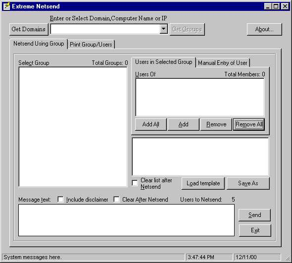



## Extreme Netsend App

### Description

This is a Windows NT netsend application. (This is my first submission!) This app Allows NT users to send messages across the network to single users, selected users, or a selected domain. The app allows users to store different netsend groups and allows the manual entry of a particular user to netsend.

This app was created from a base program called netsender that was downloaded from this site. I adding some of my own features and pieced together small chunks of code from various sources, then cleaned up the app, threw in correct tab stops, Alt keys etc.

Thanks to Many people for their contributions. Use it how you wish!

This program requires ADSI 2.5 runtime (activeDS.tlb). If you don't have this library, it can be downloaded here: http://www.microsoft.com/ntserver/nts/downloads/other/ADSI25/default.asp

Windows 2000 includes the ADSI 2.5 runtime.

This program also requires the Microsoft Scripting Runtime (scrrun.dll) which can be obtained by installing any one of the following packages:

Windows Script Host

Windows NT Option Pack

Microsoft Internet Information Server 3.0

Scripting 3.1 upgrade

Visual Studio 98

Visual Basic 6.0
 
### More Info
 
This program requires ADSI 2.5 runtime (activeDS.tlb)

If you don't have this library, it can be downloaded here: http://www.microsoft.com/ntserver/nts/downloads/other/ADSI25/default.asp

Windows 2000 includes the ADSI 2.5 runtime.

This program also requires the Microsoft Scripting Runtime (scrrun.dll - i used version # 5.1.0.4615) which can be obtained by installing any one of the following packages:

Windows Script Host

Windows NT Option Pack

Microsoft Internet Information Server 3.0

Scripting 3.1 upgrade

Visual Studio 98

Visual Basic 6.0

NOTE: earlier versions of the scripting runtime library may not work as they may not include all necessary constants. JUST get the latest version of the library and it'll work.

             |
---                |---
**Submitted On**   |2000-12-11 16:12:36
**By**             |[Charlie Kirkwood](https://github.com/Planet-Source-Code/PSCIndex/blob/master/ByAuthor/charlie-kirkwood.md)
**Level**          |Advanced
**User Rating**    |4.9 (78 globes from 16 users)
**Compatibility**  |VB 6\.0
**Category**       |[Complete Applications](https://github.com/Planet-Source-Code/PSCIndex/blob/master/ByCategory/complete-applications__1-27.md)
**World**          |[Visual Basic](https://github.com/Planet-Source-Code/PSCIndex/blob/master/ByWorld/visual-basic.md)
**Archive File**   |[CODE\_UPLOAD1259312112000\.zip](https://github.com/Planet-Source-Code/charlie-kirkwood-extreme-netsend-app__1-13519/archive/master.zip)

### API Declarations

lots, just look into the code

